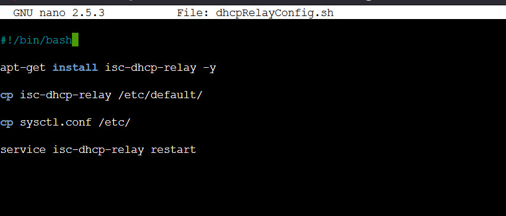
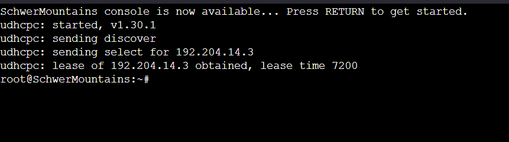

# Jarkom-Modul-5-D26-2023

* Fathan Abi Karami (5025211156)
* Alya Putri Salma (5025211174)

# topologi


# Konfigurasi Subnet
## pembagian subnet


## spesifikasi subnet


## pembagian ip VLSM


## Tabel IP


# Konfigurasi Node
Aura:
```txt
auto eth0
iface eth0 inet dhcp

auto eth1
iface eth1 inet static
	address 192.204.14.129
	netmask 255.255.255.252

auto eth2
iface eth2 inet static
	address 192.204.14.133
	netmask 255.255.255.252
```

Heiter:
```txt
auto eth0
iface eth0 inet static
	address 192.204.14.130
	netmask 255.255.255.252

auto eth1
iface eth1 inet static
	address 192.204.0.1
	netmask 255.255.248.0

auto eth2
iface eth2 inet static
	address 192.204.8.1
	netmask 255.255.252.0
```

Frieren:
```txt
auto eth0
iface eth0 inet static
	address 192.204.14.134
	netmask 255.255.255.252

auto eth1
iface eth1 inet static
	address 192.204.14.137
	netmask 255.255.255.252

auto eth2
iface eth2 inet static
	address 192.204.14.141
	netmask 255.255.255.252
```

Himmel:
```txt
auto eth0
iface eth0 inet static
	address 192.204.14.142
	netmask 255.255.255.252
	gateway 192.204.14.141


auto eth1
iface eth1 inet static
	address 192.204.12.1
	netmask 255.255.254.0

auto eth2
iface eth2 inet static
	address 192.204.14.1
	netmask 255.255.255.128
```

Fern:
```txt
auto eth0
iface eth0 inet static
	address 192.204.14.2
	netmask 255.255.255.128
	gateway 192.204.14.1

auto eth1
iface eth1 inet static
	address 192.204.14.145
	netmask 255.255.255.252

auto eth2
iface eth2 inet static
	address 192.204.14.149
	netmask 255.255.255.252
```

Richter:
```txt
auto eth0
iface eth0 inet static
	address 192.204.14.146
	netmask 255.255.255.252
	gateway 192.204.14.145
```

Revolte:
```txt
auto eth0
iface eth0 inet static
	address 192.204.14.150
	netmask 255.255.255.252
	gateway 192.204.14.149
```

Sein:
```txt
auto eth0
iface eth0 inet static
	address 192.204.8.2
	netmask 255.255.252.0
	gateway 192.204.8.1
```

Stark:
```txt
auto eth0
iface eth0 inet static
	address 192.204.14.138
	netmask 255.255.255.252
	gateway 192.204.14.137
```

TurkRegion:
```txt
auto eth0
iface eth0 inet dhcp
```

GrobeForest:
```txt
auto eth0
iface eth0 inet dhcp
```

LaubHills:
```txt
auto eth0
iface eth0 inet dhcp
```

SchwerMountains:
```txt
auto eth0
iface eth0 inet dhcp
```

# Konfigurasi Route
Aura:
```bash
route add -net 192.204.8.0 netmask 255.255.255.0 gw 192.204.14.130
route add -net 192.204.0.0 netmask 255.255.255.248 gw 192.204.14.130
route add -net 192.204.14.136 netmask 255.255.255.252 gw 192.204.14.134
route add -net 192.204.14.140 netmask 255.255.255.252 gw 192.204.14.134
route add -net 192.204.12.0 netmask 255.255.254.0 gw 192.204.14.134
route add -net 192.204.14.0 netmask 255.255.255.128 gw 192.204.14.134
route add -net 192.204.14.144 netmask 255.255.255.252 gw 192.204.14.134
route add -net 192.204.14.148 netmask 255.255.255.252 gw 192.204.14.134
```
Heiter:
```bash
route add -net 0.0.0.0 netmask 0.0.0.0 gw 192.204.14.129
```

Frieren:
```bash
route add -net 0.0.0.0 netmask 0.0.0.0 gw 192.204.14.133
route add -net 192.204.12.0 netmask 255.255.254.0 gw 192.204.14.142
route add -net 192.204.14.0 netmask 255.255.255.128 gw 192.204.14.142
route add -net 192.204.14.144 netmask 255.255.255.252 gw 192.204.14.142
route add -net 192.204.14.148 netmask 255.255.255.252 gw 192.204.14.142
```

Himmel:
```bash
route add -net 0.0.0.0 netmask 0.0.0.0 gw 192.204.14.141
route add -net 192.204.14.144 netmask 255.255.255.252 gw 192.204.14.2
route add -net 192.204.14.148 netmask 255.255.255.252 gw 192.204.14.2
```

Fern:
```bash
route add -net 0.0.0.0 netmask 0.0.0.0 gw 192.204.14.1
```

# konfigurasi DNS
jalankan:
```bash
echo nameserver 192.168.122.1 > /etc/resolv.conf

apt-get update
```

jalankan script:


named.conf.options:


# Konfigurasi DHCP
## Konfigurasi DHCP Server (Revolte)
jalankan:
```bash
echo nameserver 192.168.122.1 > /etc/resolv.conf

apt-get update
```
jalankan script:


dhcpd.conf:


isc-dhcp-server:


## Konfigurasi DHCP Relay (Heiter & Himmel)
jalankan:
```bash
echo nameserver 192.168.122.1 > /etc/resolv.conf

apt-get update
```

jalankan script:




isc-dhcp-relay:


sysctl.conf:


## Tes DHCP
TurkRegion:


GrobeForest:


LaubHills:


SchwerMountains:



# Soal 1
Agar topologi yang kalian buat dapat mengakses keluar, kalian diminta untuk mengkonfigurasi Aura menggunakan iptables, tetapi tidak ingin menggunakan MASQUERADE.

## Jawab
```bash
iptables -t nat -A POSTROUTING -s 192.204.0.0/16 -o eth0 -j SNAT --to-s [ip eth0] 
```

pada table nat, chain POSTROUTING, dengan source subnet 192.204.0.0/16 dan output ke luar (eth 0), menambah rules untuk ubah source ip packet ke ip eth0


## Tes
ping google.com pada revolte


## Soal 2
Kalian diminta untuk melakukan drop semua TCP dan UDP kecuali port 8080 pada TCP.

## Jawab
Pada laubhills:
```bash
iptables -F
iptables -A INPUT -p udp -j DROP
iptables -A INPUT -p tcp --dport 8080 -j ACCEPT
iptables -A INPUT -p tcp -j DROP
```

rules 1 : flush

rules 2 : drop semua packet udp

rules 3 : accept semua paket tcp dengan destination port 8080

rules 4 : drop semua paket tcp


## Tes
tes menggunakan netcat dari TurkRegion

tes udp:


tes tcp:


tes tcp port 8080:


# Soal 3
Kepala Suku North Area meminta kalian untuk membatasi DHCP dan DNS Server hanya dapat dilakukan ping oleh maksimal 3 device secara bersamaan, selebihnya akan di drop.

## jawab
```bash
iptables -F
iptables -A INPUT -m state --state ESTABLISHED,RELATED -j ACCEPT
iptables -A INPUT -p icmp -m connlimit --connlimit-above 3 --connlimit-mask 0 -j DROP
```

rules 1 : flush

rules 2 : accept packet dengan state Established, Related

rules 3 : Drop packet dengan protocol ICMP, gunakan modul conlimit untuk membatasi concurrent connection,  --connlimit-above 3 jika jumlah concurrent connection lebih dari 3, --connlimit-mask 0 tidak menggunakan dest ip


## TES
lakukan tes ping dari client


# Soal 4
Lakukan pembatasan sehingga koneksi SSH pada Web Server hanya dapat dilakukan oleh masyarakat yang berada pada GrobeForest.

## jawab
koneksi SSH menggunakan protocol tcp dengan port 22

```bash
iptables -F 
iptables -A INPUT -p tcp --dport 22 -s 192.204.8.0/22 -j ACCEPT
iptables -A INPUT -p tcp --dport 22 -j DROP
```

rules 1 : flush

rules 2 : ACCEPT koneksi tcp port 22 dari subnet 192.204.8.0

rules 3 : DROP koneksi tcp port 22


## TES


## Soal 5, 6
5. Selain itu, akses menuju WebServer hanya diperbolehkan saat jam kerja yaitu Senin-Jumat pada pukul 08.00-16.00.

6. Lalu, karena ternyata terdapat beberapa waktu di mana network administrator dari WebServer tidak bisa stand by, sehingga perlu ditambahkan rule bahwa akses pada hari Senin - Kamis pada jam 12.00 - 13.00 dilarang (istirahat maksi cuy) dan akses di hari Jumat pada jam 11.00 - 13.00 juga dilarang (maklum, Jumatan rek).

## Jawab
```bash
iptables -F
iptables -A INPUT -p tcp --dport 80 -m time --timestart 12:00 --timestop 13:00 --weekdays Mon,Tue,Wed,Thu -j DROP
iptables -A INPUT -p tcp --dport 80 -m time --timestart 11:00 --timestop 13:00 --weekdays Fri -j DROP
iptables -A INPUT -p tcp --dport 80 -m time --timestart 08:00 --timestop 16:00 --weekdays Mon,Tue,Wed,Thu,Fri -j ACCEPT
iptables -A INPUT -p tcp --dport 80 -j DROP
```

rules 1 : flush

rules 2 : DROP packet koneksi tcp port 80 dari jam 12:00 - 13:00, hari senin-kamis

rules 3 : Drop packet koneksi tcp port 80 dari jam 11:00 - 13:00, hari jumat

rules 4 : ACCEPT packet koneksi tcp port 80 dari jam 08:00 = 16:00, hari senin-jumat

rules 5 : DROP packet koneksi tcp port 80


## Tes
jam Kerja:


Di Luar jam kerja:


Di Luar Hari Kerja:


Saat jam istirahat selain hari jumat:


saat jam istirahat hari jumat:

 

# Soal 8
Karena berbeda koalisi politik, maka subnet dengan masyarakat yang berada pada Revolte dilarang keras mengakses WebServer hingga masa pencoblosan pemilu kepala suku 2024 berakhir. Masa pemilu (hingga pemungutan dan penghitungan suara selesai) kepala suku bersamaan dengan masa pemilu Presiden dan Wakil Presiden Indonesia 2024.

## Jawab
pemungutan suara 14 Feb 2024

Rekapitulasi perhitungan suara 20 Maret 2024

```bash
iptables -F
iptables -A INPUT -p tcp --dport 80 -m time --datestart 2024-02-14T00:00:00 --datestop 2024-03-20T23:59:59 -j DROP
```

rules 1 : flush

rules 2 : drop koneksi tcp 80 dari tanggal 14 Feb 2024 00:00 sampai 20 Maret 2024 23:59


## TES
sebelum pemilu:


saat pemilu:


setelah pemilu:


# Revisi dan Kendala
Revisi:

* Revisi no 5 saat penulisan rules jam kerja, pada rules ditulis jam (07:00 - 15:00) salah abca, Revisi jam (08:00 - 16:00)

kendala:


